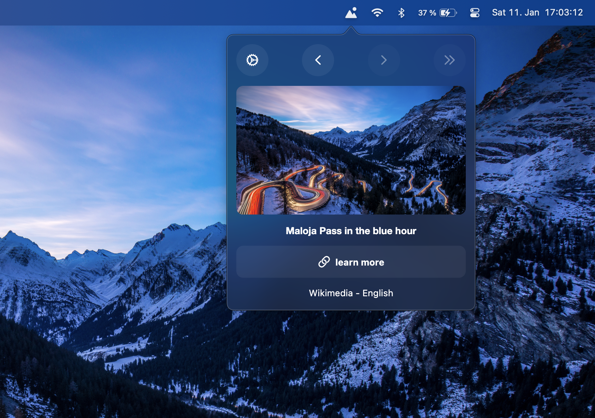
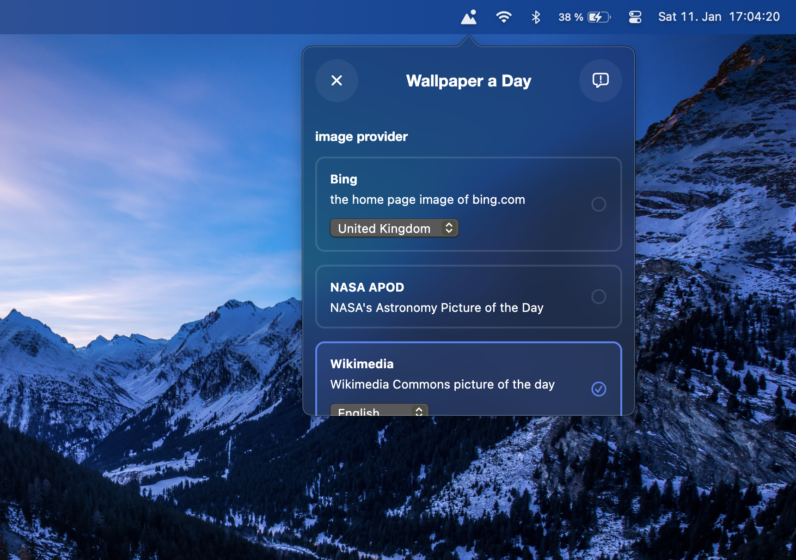

# Wallpaper a Day __

Wallpaper a Day is a simple macOS app that changes your wallpaper every day. Discover new wallpapers from multiple sources that also provide additional information about the images.

### wallpaper providers

- [Bing](https://www.bing.com) (multiple locales)
- [NASA APOD](https://apod.nasa.gov/apod/)
- [WikiMedia](https://commons.wikimedia.org/wiki/Main_Page) (multiple locales)

### Screenshots

__
__

### Install

1. download it [here](https://apps.robbb.in/wallpaper_a_day) for macOS

### contribute

- you can build the application yourself using [Flutter](https://flutter.dev)
- feel free to reach out if you find issues or have suggestions

Have a great day, 
Yours, Robin

